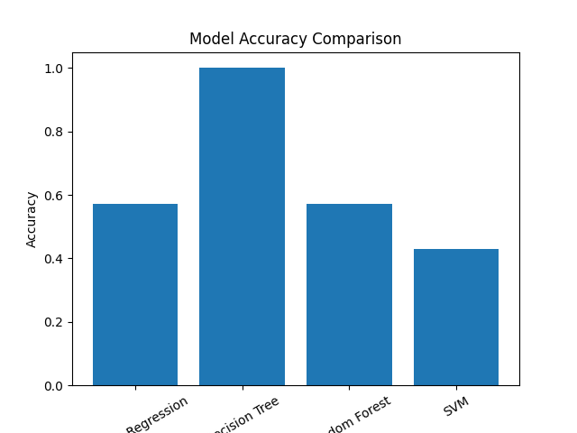

# Water Infrastructure Priority Prediction using Hybrid PSO + Bat Algorithm (BSO)

## Project Overview

Access to safe drinking water is a critical infrastructure challenge in many regions.  
This project aims to **predict infrastructure priority levels for water supply development** using machine learning and swarm intelligence optimization techniques.

The model analyzes district-level urban water supply data to determine which areas should be prioritized for infrastructure development.

A **hybrid optimization model combining Particle Swarm Optimization (PSO) and the Bat Algorithm (BA)** is used to improve prediction performance.

The hybrid model optimizes feature weights to predict priority levels based on water coverage statistics.

---

## Dataset

The dataset used in this project:


RS_Session_259_AU_1152_C.csv


It contains district-level information about:

- Number of Urban Local Bodies (ULBs)
- Total households
- Households with tap connections
- Households without tap connections

These features help identify infrastructure gaps in water supply.

---

## Feature Engineering

Three main features are generated:

### 1. Coverage Percentage
Percentage of households with tap connections.


Coverage = Tap Connections / Total Households


### 2. Gap Households
Number of households lacking tap connections.


Gap = Total Households - Tap Connections


### 3. ULB Density
Urban local bodies relative to total households.


ULB Density = ULBs / Total Households


---

## Target Variable

Priority levels are created using quantile-based classification:

| Priority Level | Meaning |
|----------------|--------|
| 0 | Low Priority |
| 1 | Medium Priority |
| 2 | High Priority |

Districts with **lower coverage receive higher priority**.

---

## Hybrid Optimization Model

### 1. Particle Swarm Optimization (PSO)

PSO simulates swarm intelligence where particles search the solution space to find optimal feature weights.

Advantages:

- Fast convergence
- Good global search capability

---

### 2. Bat Algorithm (BA)

The Bat Algorithm refines the PSO solution using echolocation-based optimization.

Advantages:

- Strong local search
- Improves final solution quality

---

### Hybrid Workflow


Dataset
↓
Feature Engineering
↓
Train/Test Split
↓
PSO Optimization
↓
Bat Algorithm Refinement
↓
Hybrid Prediction Model
↓
Evaluation & Visualization


---

## Technologies Used

- Python
- Pandas
- NumPy
- Scikit-Learn
- Matplotlib
- Seaborn
- Joblib
- YAML
- JSON
- HDF5

---

## Installation

Install required packages:

```bash
pip install pandas numpy matplotlib seaborn scikit-learn joblib pyyaml h5py
Project Structure
Water Infrastructure Priority Prediction
│
├── RS_Session_259_AU_1152_C.csv
├── bso_hybrid_model.py
├── README.md
│
├── Results
│   ├── bso_predictions.csv
│   ├── bso_results.csv
│
├── Models
│   ├── bso_model.pkl
│   ├── bso_model.h5
│
├── Metadata
│   ├── bso_metadata.yaml
│   ├── bso_results.json
│
└── Graphs
    ├── bso_confusion_matrix.png
    ├── bso_heatmap.png
    ├── bso_prediction_graph.png
    └── bso_priority_distribution.png
Running the Project

Run the script:

python bso_hybrid_model.py

The script will:

Load the dataset

Perform feature engineering

Train the hybrid PSO + BA model

Generate predictions

Save visualizations

Export results and model files

Generated Outputs
Graphs
Graph	Description
Confusion Matrix	Classification performance
Feature Heatmap	Correlation between features
Prediction Graph	Actual vs Predicted values
Priority Distribution	Distribution of priority levels
CSV Files
bso_predictions.csv





Contains:

Actual Priority
Predicted Priority
bso_results.csv

Full dataset with computed features.

Model Files
bso_model.pkl

Serialized model weights using Joblib.

bso_model.h5

HDF5 format for interoperability.

Metadata Files
bso_metadata.yaml

Stores:

model name

features used

accuracy score

bso_results.json

JSON format prediction results.

Evaluation Metric

Accuracy is used to evaluate the prediction model.

Accuracy = Correct Predictions / Total Predictions

Confusion matrix is used to visualize classification performance.

Example Output
Hybrid PSO + BA Accuracy: 0.87
All BSO hybrid results saved successfully
Applications

This system can be used by:

Urban planning departments

Water resource management agencies

Government infrastructure planning

Smart city initiatives

It helps identify high priority regions for water infrastructure investment.

Future Improvements

Possible enhancements:

Deep learning models

GIS integration

Real-time data pipelines

Multi-objective optimization

Additional socio-economic features

# Author
Sagnik Patra
